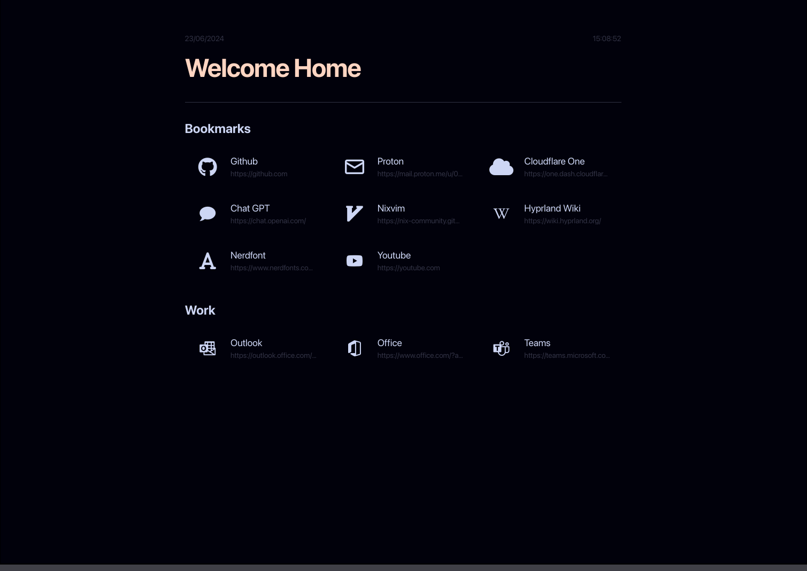

# Homepage

My homepage is a static site built with SvelteKit and TailwindCSS. It allows you to add your own links and customize the theme of your start page.

You can find an example of a config file in `src/routes/config.json`. You can copy this file and modify it to your liking.

## Screenshot:

