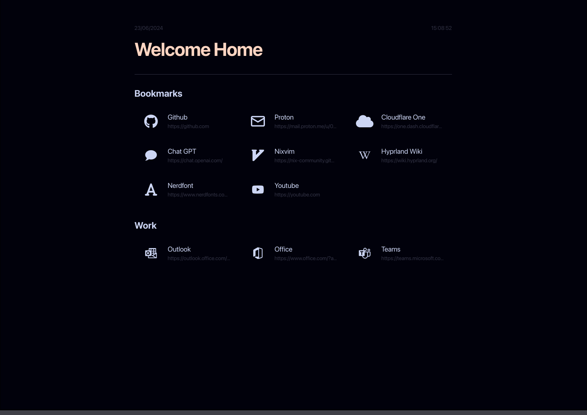

<div align="center">
    
</div>

<br>

# Homepage

<br>
<div align="center">
    <a href="https://github.com/anotherhadi/homepage">
        
    </a>
    <a href="https://github.com/anotherhadi/homepage/stargazers">
        
    </a>
    <a href="https://github.com/anotherhadi/homepage/">
        
    </a>
    <a href="https://github.com/anotherhadi/homepage/blob/main/LICENSE">
        
    </a>
</div>
<br>

My homepage is a static site built with SvelteKit and TailwindCSS. It allows you to add your own links and customize the theme of your start page.
It use a Nerdfont font to display icons.

You can find an example of a config file in `src/routes/config.json`. You can copy this file and modify it to your liking.

## Screenshot:



## Installation:

### Npm

```bash
git clone https://github.com/anotherhadi/homepage
cd homepage
npm install
npm run build
```

The website content is on the `build` folder

### Nix

Todo